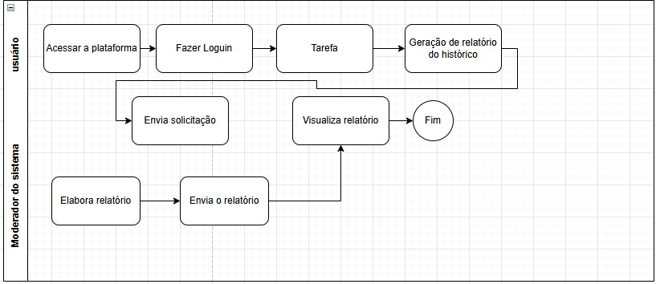

# 3. Modelagem dos Processos de Negócio

Introdução
Com o aumento do consumo energético e a busca por eficiência no uso da eletricidade, o monitoramento inteligente de energia se torna essencial para usuários residenciais. Nosso sistema foi desenvolvido para oferecer uma visão clara e detalhada do consumo, permitindo identificar padrões, reduzir gastos e detectar anomalias. A solução é estruturada em três categorias de processos: primários, de suporte e gerenciais, com melhorias nos fluxos de cadastro, análise e geração de relatórios.

Processos Primários são coleta de Dados do Consumo, Análise de Consumo, Notificação ao Usuário, Geração de Relatórios
Processos de Suporte são Gerenciamento de Dispositivos, Gestão de Usuários, Infraestrutura de TI, Cadastro de Eletrodomésticos, Cadastro do Fórum, Cadastro de Dicas
Processos Gerenciais, Monitoramento da Qualidade do Serviço, Gestão de Anomalias, Auditoria e Relatórios Gerenciais
Entradas e Saídas dos Processos

| Processo                  | Entradas                              | Saídas                                   |
|---------------------------|---------------------------------------|------------------------------------------|
| Coleta de Dados           | Leituras dos medidores inteligentes   | Dados armazenados no banco de dados      |
| Análise de Consumo        | Dados coletados                       | Padrões detectados, alertas gerados      |
| Notificação ao Usuário    | Alertas gerados                       | Mensagens enviadas (SMS, e-mail, app)    |
| Geração de Relatórios     | Dados históricos de consumo           | Relatórios acessíveis via sistema        |
| Cadastro de Eletrodomésticos | Dados do aparelho (potência, uso)  | Estimativas de consumo por dispositivo   |
| Cadastro do Fórum         | Postagens e interações dos usuários   | Banco de conhecimento compartilhado      |
| Cadastro de Dicas         | Dicas personalizadas                  | Recomendações para redução de consumo    |

Localização dos Processos Na Residência:** Medidor inteligente coleta e transmite dados.No Servidor na Nuvem: Sistema processa dados, identifica padrões e gera relatórios. No App/Site do Usuário:** Acesso a consumo, alertas, fórum e dicas.No Painel do Administrador: Equipes de suporte gerenciam dispositivos e monitoram desempenho.
Participantes do Processo Medidores Inteligentes: Coletam dados de consumo.Sistema de Monitoramento:** Processa informações e gera insights. Usuários: Cadastram eletrodomésticos, interagem no fórum e recebem dicas. Equipe Técnica: Mantém dispositivos e servidores. Administradores: Supervisionam desempenho e gerenciam acessos.

Produtos de Informação Relatórios de Consumo: Histórico detalhado com gráficos e comparações. Alertas de Consumo Elevado: Notificações em tempo real. Relatórios Técnicos: Logs de funcionamento do sistema. Relatórios de Gestão:** Dados analíticos para otimização energética. Dicas Personalizadas:** Sugestões baseadas no perfil de consumo.

Conexão com a Arquitetura do Software - Usuários e Permissões:** Perfis diferenciados (morador, administrador, técnico).
Banco de Dados: Estrutura ampliada para suportar novos recursos: - Tabela Eletrodomésticos (id, usuário_id, nome, potência, tempo_uso) - Tabela Fórum (id, usuário_id, postagem, data) - Tabela Dicas (id, categoria, conteúdo) - Tabela Usuários (id, nome, e-mail, tipo) - Tabela Medidores (id, residência, status) - Tabela Registros de Consumo (medidor_id, timestamp, consumo) - Tabela Alertas (usuário_id, tipo, data) - Tabela Relatórios (usuário_id, período, dados)

# 3.1. Modelagem da situação atual (Modelagem AS IS)
Atualmente, muitas pessoas enfrentam problemas com contas de luz elevadas, o que representa um grande impacto financeiro, principalmente em residências que possuem um uso descontrolado de energia. Isso acontece por diversas razões:
 
 Falta de Informação Clara
 Muitas vezes, os usuários não têm uma visão detalhada e compreensível do seu consumo de energia. As informações fornecidas pelas distribuidoras de energia são, em geral, complexas e difíceis de interpretar, o que gera desconhecimento sobre o consumo real.
 
 Dificuldade de Identificação de Padrões de Consumo
 O consumo de energia muitas vezes é afetado por práticas diárias que podem ser difíceis de identificar sem uma análise detalhada. Lâmpadas deixadas acesas, aparelhos em stand-by ou uso excessivo de aquecedores são exemplos de fatores que podem aumentar a conta de luz, 
 mas que muitas pessoas não percebem no dia a dia.
 
 Processos Manuais e Fragmentados
 Em muitos casos, os consumidores tentam monitorar o consumo de energia por conta própria, seja com anotações manuais ou por meio de ferramentas complicadas. Isso gera retrabalho, erros de cálculo e confusão.
 
 Falta de Ações Corretivas
 Sem uma ferramenta clara e acessível para identificar o consumo elevado, muitos consumidores não conseguem tomar ações corretivas a tempo. Isso resulta em alta frequência de contas de energia elevadas, o que afeta o orçamento doméstico e impacta negativamente o meio 
 ambiente devido ao consumo excessivo.
 
 Problemas Identificados
 Os principais problemas associados a esse cenário são:
 Desconhecimento do Consumo Real: O consumidor muitas vezes não tem uma visão clara de quando ou por que está gastando mais energia. Dificuldade de Ação: A falta de ferramentas fáceis de usar impede que os consumidores tomem decisões rápidas para reduzir o consumo, como desligar aparelhos quando não estão em uso. Impacto Econômico e Ambiental: O consumo elevado de energia não só resulta em contas altas, mas também contribui para maiores emissões de CO2, impactando negativamente o meio ambiente.
 
Solução Proposta com a Automação
 O uso de nosso aplicativo de monitoramento de consumo de energia propõe uma solução simples, intuitiva e eficiente para resolver esses problemas:
 Interface Simples e Acessível
 
 Solução**: O aplicativo oferece uma interface amigável e de fácil compreensão, com linguagem clara e simples, ideal até mesmo para idosos.
 Benefício**: Com isso, qualquer usuário, independentemente da idade, poderá compreender seu consumo de energia e tomar decisões informadas para reduzi-lo.
 
 Monitoramento em Tempo Real
 Solução: O sistema irá monitorar o consumo de energia em tempo real, identificando o gasto energético de cada aparelho individualmente e fornecendo dados atualizados sobre o consumo diário e mensal de cada dispositivo. Benefício: Os usuários terão uma visão 
 instantânea e precisa do que estão gastando, permitindo que tomem ações corretivas imediatas (como desligar aparelhos ou otimizar o uso de energia).
 
 Alertas e Recomendações Personalizadas
 Solução: O aplicativo enviará alertas automáticos caso o consumo ultrapasse um limite preestabelecido ou se identificar padrões de consumo elevados.Benefício**: Os usuários receberão alertas de como reduzir o consumo de energia.
 
 Relatórios Simples e Visuais
 Solução: O sistema gerará relatórios visuais e fáceis de entender, com gráficos simples que mostram o histórico de consumo.
 Benefício**: Esses relatórios permitem que os usuários vejam claramente a diferença de consumo de um aparelho para o outro.

# 3.2. Descrição geral da proposta (Modelagem TO BE)
A solução proposta busca otimizar o monitoramento do consumo de energia por meio intelignte. Com a introdução de um sistema digital integrado, os usuários terão acesso a dados em tempo real, notificações personalizadas e insights para reduzir desperdícios.

 Alinhamento com a Estratégia e Objetivos do Negócio
- Eficiência Energética: Permitir que os usuários identifiquem desperdícios e otimizem o uso de eletricidade.
- Acessibilidade e Usabilidade: Interface intuitiva, fácil de interpretar e adaptável para diferentes perfis de usuários.
- Automação de Processos: Redução da necessidade de monitoramento manual, tornando o acompanhamento do consumo mais preciso.
- Sustentabilidade: Incentivo a práticas mais ecológicas por meio de recomendações inteligentes.

Limitações da Solução
- Dependência de Hardware: Necessário o uso de medidores inteligentes compatíveis.
- Conectividade: O funcionamento em tempo real depende de conexão estável com a internet.
- Adoção pelo Usuário: Alguns usuários podem ter dificuldades na adaptação a novas tecnologias.

# 3.3. Modelagem dos processos

### Processo 1: Coleta e Análise de Consumo
Este processo automatiza a coleta de dados dos medidores inteligentes e sua análise em tempo real. O sistema detecta padrões de consumo e gera alertas para ajudar os usuários a otimizarem seu uso de energia.
Fluxo do Processo: Participantes - Usuário e Fluxogama Funcional

### Processo 2: Notificação Inteligente e Ações Corretivas
Este processo assegura que os usuários recebam alertas automáticos sempre que houver consumo excessivo ou incomum, além de fornecer sugestões para economia.
Fluxo do Processo:

### Processo 3: Notificação Inteligente e Ações Corretivas
Este processo assegura que os usuários recebam alertas automáticos sempre que houver consumo excessivo ou incomum, além de fornecer sugestões para economia.
Fluxo do Processo:

### Processo 4: Notificação Inteligente e Ações Corretivas
Este processo assegura que os usuários recebam alertas automáticos sempre que houver consumo excessivo ou incomum, além de fornecer sugestões para economia.
Fluxo do Processo:

### Oportunidades de Melhoria
- Personalização dos alertas com base no perfil do usuário.
- Automação de resposta, permitindo desligamento remoto de dispositivos.
