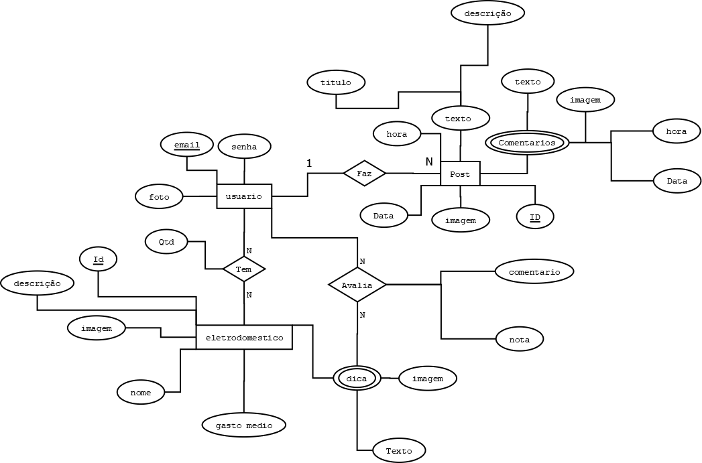

## 4. Projeto da Solução

Pré-requisitos: <a href="03-Modelagem do Processo de Negocio.md"> Modelagem do Processo de Negocio</a>

## 4.1. Arquitetura da solução

A arquitetura da solução foi pensada para ser simples, escalável e fácil de manter, utilizando tecnologias web amplamente adotadas.
O sistema é composto por:

• Frontend (cliente): desenvolvido com HTML, CSS e JavaScript (com opção de usar frameworks como React ou Vue.js), responsável por exibir as páginas da calculadora, dicas, fórum e perfil do usuário.

• Backend (servidor): API desenvolvida em Node.js (ou Python com Flask), hospedada no Heroku ou Render, que processa os cálculos de consumo, armazena dados do usuário e gerencia o fórum.

• Banco de Dados: MongoDB ou Firebase, para armazenar os registros dos cálculos, usuários, dicas e postagens do fórum.

• Armazenamento Local: o navegador pode utilizar LocalStorage para manter preferências ou dados temporários.

• APIs externas (futuro opcional): integração com APIs de energia elétrica para tarifa automática ou APIs de previsão do tempo para consumo inteligente

 

### 4.2. Protótipos de telas

## Diagrama de Classes

O diagrama de classes ilustra graficamente como será a estrutura do software, e como cada uma das classes da sua estrutura estarão interligadas. Essas classes servem de modelo para materializar os objetos que executarão na memória.

As referências abaixo irão auxiliá-lo na geração do artefato “Diagrama de Classes”.

> - [Diagramas de Classes - Documentação da IBM](https://www.ibm.com/docs/pt-br/rational-soft-arch/9.6.1?topic=diagrams-class)
> - [O que é um diagrama de classe UML? | Lucidchart](https://www.lucidchart.com/pages/pt/o-que-e-diagrama-de-classe-uml)

## Modelo ER

O Modelo ER representa através de um diagrama como as entidades (coisas, objetos) se relacionam entre si na aplicação interativa.]

As referências abaixo irão auxiliá-lo na geração do artefato “Modelo ER”.

> - [Como fazer um diagrama entidade relacionamento | Lucidchart](https://www.lucidchart.com/pages/pt/como-fazer-um-diagrama-entidade-relacionamento)

### 4.3. Modelo de dados
#### 4.3.1 Modelo ER

#### 4.3.2 Esquema Relacional

---

#### 4.3.3 Modelo Físico

CREATE DATABASE IF NOT EXISTS Sistema`

-- Table Usuario

CREATE TABLE IF NOT EXISTS Usuario (
  email VARCHAR(255) NOT NULL,
  foto VARCHAR(255),
  senha VARCHAR(255) NOT NULL,
  PRIMARY KEY (email)
);

-- Table Eletrodomestico

CREATE TABLE IF NOT EXISTS Eletrodomestico (

  Id INT NOT NULL AUTO_INCREMENT,
  
  descricao TEXT,
  
  Imagem VARCHAR(255),
  
  nome VARCHAR(100) NOT NULL,
  
  gastoMedio DECIMAL(10,2) NOT NULL,
  
  PRIMARY KEY (Id)
  
);

-- Table UsuTemEletro

CREATE TABLE IF NOT EXISTS UsuTemEletro (

  FkEmail VARCHAR(255) NOT NULL,
  
  FkId INT NOT NULL,
  
  PRIMARY KEY (FkEmail, FkId),
  
  CONSTRAINT fk_Usuario_Eletro
  
   FOREIGN KEY (FkEmail)
    
   REFERENCES Usuario (email)
    
   ON DELETE CASCADE
    
   ON UPDATE CASCADE,
    
  CONSTRAINT fk_Eletrodomestico
  
   FOREIGN KEY (FkId)
    
   REFERENCES Eletrodomestico (Id)
    
   ON DELETE CASCADE
    
   ON UPDATE CASCADE
    
);

-- Table Post

CREATE TABLE IF NOT EXISTS Post (

  ID INT NOT NULL AUTO_INCREMENT,
  
  Hora TIME NOT NULL,
  
  Data DATE NOT NULL,
  
  Imagem VARCHAR(255),
  
  descricao TEXT,
  
  titulo VARCHAR(150) NOT NULL,
  
  FkEmail VARCHAR(255) NOT NULL,
  
  PRIMARY KEY (ID),
  
  CONSTRAINT fk_Post_Usuario
  
   FOREIGN KEY (FkEmail)
    
   REFERENCES Usuario (email)
    
   ON DELETE CASCADE
    
   ON UPDATE CASCADE
    
);

-- Table Comentario

CREATE TABLE IF NOT EXISTS Comentario (

  ID INT NOT NULL AUTO_INCREMENT,
  
  texto TEXT NOT NULL,
  
  hora TIME NOT NULL,
  
  data DATE NOT NULL,

  imagem VARCHAR(255),
  
  FKID INT NOT NULL,
  
  PRIMARY KEY (FKID),
  
  CONSTRAINT fk_Comentario_Post
  
   FOREIGN KEY (FKID)
    
   REFERENCES Post (ID)
    
   ON DELETE CASCADE
    
   ON UPDATE CASCADE
);

### 4.4. Tecnologias

_Descreva qual(is) tecnologias você vai usar para resolver o seu problema, ou seja, implementar a sua solução. Liste todas as tecnologias envolvidas, linguagens a serem utilizadas, serviços web, frameworks, bibliotecas, IDEs de desenvolvimento, e ferramentas._

Apresente também uma figura explicando como as tecnologias estão relacionadas ou como uma interação do usuário com o sistema vai ser conduzida, por onde ela passa até retornar uma resposta ao usuário.

| **Dimensão**   | **Tecnologia**  |
| ---            | ---             |
| SGBD           | MySQL           |
| Front end      | HTML+CSS+JS     |
| Back end       | Java SpringBoot |
| Deploy         | Github Pages    |

