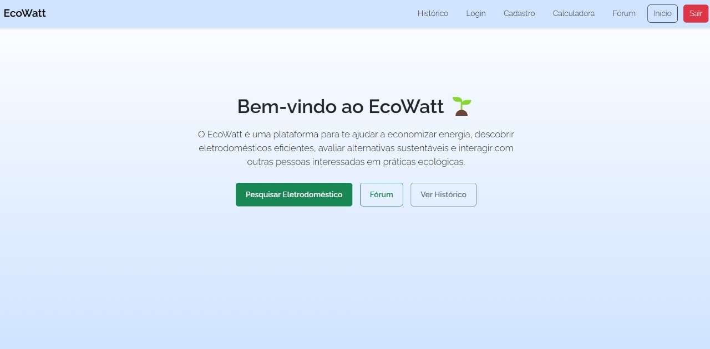

# 6. Interface do Sistema

Pré-requisitos: <a href="4-Projeto-Solucao.md"> Projeto da Solução</a>

_Visão geral da interação do usuário por meio das telas do sistema. Apresente as principais interfaces da plataforma._

## 6.1. Tela principal do sistema

Tela principal onde você pode ecessar todas as funcionalidades do site

## 6.2. Telas do processo 1

Cadastro do usuario

tela para fazer o cadastro de usuario

## 6.3. Telas do processo 2

Login do usuario

tela para fazer o login de usuario

## 6.4. Telas do processo 3

Cadastrar post

tela para cadastrar o post

## 6.4. Telas do processo 4

Gerar histórico de comentários

tela que mostra o historico de comentarios do usuario cadastrado

## 6.4. Telas do processo 5

Pesquisar Eletrodoméstico

tela para de pesquisa do eletrodomestico

## 6.4. Telas do processo 6

Avaliar sugestões de eletrodomésticos

tela com as dicas personalizadas para cada eletrodomestico 

o usuario pode avaliar o eletrodomestico clicando nas estrelas embaixo da dica

